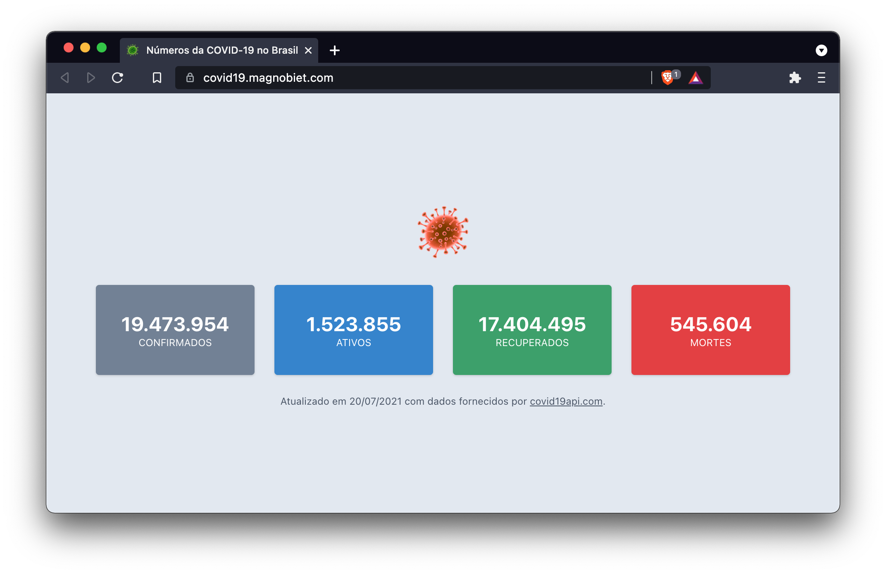

# Números da COVID-19 no Brasil

> Um simples painel mostrando os números da COVID-19 no Brazil.



## TL;DR

```bash
# Runs the app in the development mode
yarn start

# Builds the app for production to the `build` folder
yarn build
```

## Contributing

1. Fork it!
2. Create your feature branch
   - `git checkout -b feature/my-new-feature`
3. Commit your changes
   - `git commit -m "feat: add some feature"`
4. Push to the branch
   - `git push origin feature/my-new-feature`
5. Submit a pull request

## License

This package is licensed under the [MIT license](https://magno.mit-license.org/2020). Copyright © Magno Biét
